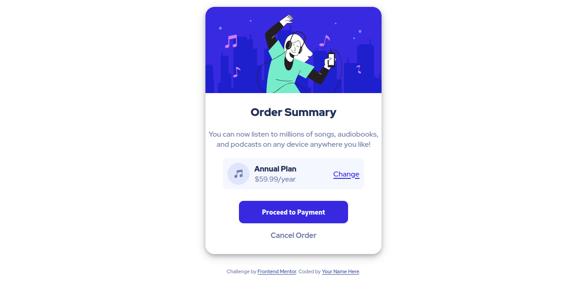

# Frontend Mentor - Order summary card solution

This is a solution to the [Order summary card challenge on Frontend Mentor](https://www.frontendmentor.io/challenges/order-summary-component-QlPmajDUj). Frontend Mentor challenges help you improve your coding skills by building realistic projects. 

## Table of contents

- [Overview](#overview)
  - [The challenge](#the-challenge)
  - [Screenshot](#screenshot)
  - [Links](#links)
- [My process](#my-process)
  - [Built with](#built-with)
  - [What I learned](#what-i-learned)
  - [Continued development](#continued-development)
  - [Useful resources](#useful-resources)
- [Author](#author)


## Overview

### The challenge

Users should be able to:

- See hover states for interactive elements

### Screenshot




### Links
- Live Site URL: [Add live site URL here](https://your-live-site-url.com)

## My process

### Built with

- Semantic HTML5 markup
- CSS custom properties
- Flexbox
- Mobile-first workflow


### What I learned

By doing this project, I learnt how to do the Mobile-first workflow which I prefer now...I also learnt how to use a background-image property in CSS.

```css
body {
    height: 100vh;
    font-family: 'Red Hat Display', sans-serif;
    font-size: 16px;
    text-align: center;
    display: flex;
    flex-direction: column;
    justify-content: center;
    align-items: center;
    gap: 30px;
    color: var(--desaturated-blue);
    font-weight: 500;
    background-image: url(images/pattern-background-desktop.svg);
    background-repeat: no-repeat;  
    background-color: var(--pale-blue);    
}
```

### Continued development
I will still be working on the responsiveness of this project as it is not very smooth for me.

### Useful resources

- [resource 1](https://www.w3schools.com) - This helped learn how to place a background image. I really liked this pattern and will use it going forward.
- [resource 2](https://www.developer.mozilla.org) - This is an amazing website which helps me  understand most of the syntax I didn't know in CSS. I'd recommend it to anyone still learning this Front End Development.


## Author

- Github - [Cybr-Coder](https://github.com/cybr-coder)
- Frontend Mentor - [@cybr-coder](https://www.frontendmentor.io/profile/cybr-coder)
- Twitter - [@cybr_coder](https://twitter.com/cybr_coder)

## Acknowledgments
- Thanks to The Odin Project for giving me a solid foundation in this field. 
- I will also applaud myself as I have seen massive improvement in my workflow. I started learning less than 2 months ago and I completed this project in 6hours...I think this is just the begining.